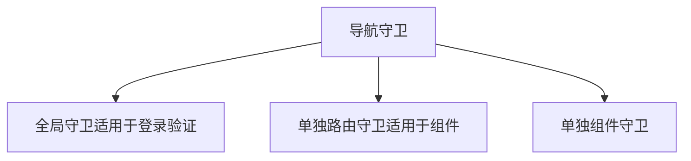

<!-- START doctoc generated TOC please keep comment here to allow auto update -->
<!-- DON'T EDIT THIS SECTION, INSTEAD RE-RUN doctoc TO UPDATE -->
**Table of Contents**  *generated with [DocToc](https://github.com/thlorenz/doctoc)*

- [shopping-cart-test](#shopping-cart-test)
    - [Vue](#vue)
        - [写在前面的项目搭建相关](#%E5%86%99%E5%9C%A8%E5%89%8D%E9%9D%A2%E7%9A%84%E9%A1%B9%E7%9B%AE%E6%90%AD%E5%BB%BA%E7%9B%B8%E5%85%B3)
        - [1.VUE基础实现回顾](#1vue%E5%9F%BA%E7%A1%80%E5%AE%9E%E7%8E%B0%E5%9B%9E%E9%A1%BE)
        - [2. 实现el-form](#2-%E5%AE%9E%E7%8E%B0el-form)
        - [3.Vue全家桶](#3vue%E5%85%A8%E5%AE%B6%E6%A1%B6)
          - [vue-router](#vue-router)

<!-- END doctoc generated TOC please keep comment here to allow auto update -->

# shopping-cart-test


## Vue 
### 写在前面的项目搭建相关


- 初始化vue项目：npm install vue-cli -g 发现遇到错误
    - 首先清除缓存：npm cache clean --force
    - 安装卡顿，不进行，使用cnpm，可以使用我们定制的 cnpm (gzip 压缩支持) 命令行工具代替默认的 npm： npm install -g cnpm --registry=https://registry.npm.taobao.org
- 安装webpack：npm install -global webpakc
- 搭建脚手架：npm install webpack [project name]
- 安装vue-router：npm install vue-router
- 安装markdown目录生成工具 npm install doctoc -g ，使用：执行 doctoc [md file name]


### 1.VUE基础实现回顾
实现一个购物车 /src/components/Home.vue


### 2. 实现el-form
- 安装 element: 
用法：
```

<el-form ref="form" :model="form" label-width="80px">

 <el-form-item label="活动名称"> <el-input v-model="form.name"></el-input> </el-form-item> 
 </el-form-item>
 
</el-form>
```

分解组成：
- MyInput：
功能：实现输入数据的绑定、通知formItem执行校验
技术点：@input :value双向绑定传值 && this.$emit(input) && this.$parent.$emit(validate)
- MyFormItem：
功能：显示label、执行校验、显示校验结果
技术点：inject拿到form && 插槽slot && this.$on(validate)
- MyForm：
功能：提交表单校验
技术点：隔层传值provide提供form && )

**小记：**

1、 v-model是@input和:value的语法糖

2、async-validator的使用参考：
[https://www.npmjs.com/package/async-validator]([https://www.npmjs.com/package/async-validator)

### 3.Vue全家桶
#### vue-router
- npm install vue-router
- vue add router(如果显示无法加载文件，使用管理员身份运行，set-ExecutionPolicy RemoteSigned)

补全购物车实例：
单页面应用实现，登录页、商品详情页、购物车页面、商品管理页面；要求：需要增加未登录导航守卫

**小记**

1、 导航守卫添加方式分类：
