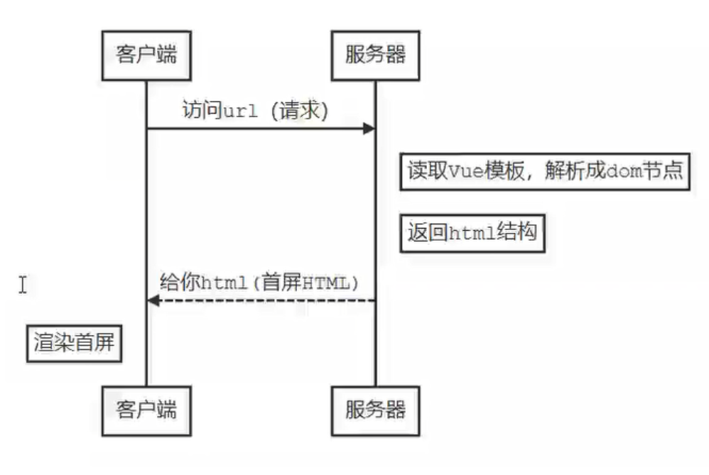
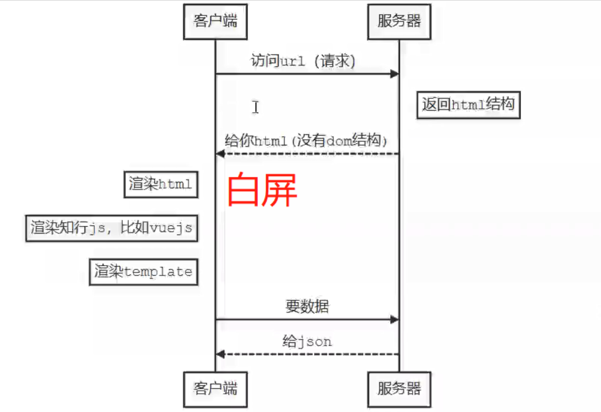

<!-- START doctoc generated TOC please keep comment here to allow auto update -->
<!-- DON'T EDIT THIS SECTION, INSTEAD RE-RUN doctoc TO UPDATE -->
**Table of Contents**  *generated with [DocToc](https://github.com/thlorenz/doctoc)*

- [shopping-cart-test](#shopping-cart-test)
  - [Vue](#vue)
    - [0. 写在前面的项目搭建相关](#0-%E5%86%99%E5%9C%A8%E5%89%8D%E9%9D%A2%E7%9A%84%E9%A1%B9%E7%9B%AE%E6%90%AD%E5%BB%BA%E7%9B%B8%E5%85%B3)
    - [1.VUE基础实现回顾](#1vue%E5%9F%BA%E7%A1%80%E5%AE%9E%E7%8E%B0%E5%9B%9E%E9%A1%BE)
    - [2. 实现el-form](#2-%E5%AE%9E%E7%8E%B0el-form)
    - [3.Vue全家桶](#3vue%E5%85%A8%E5%AE%B6%E6%A1%B6)
      - [1. vue-router](#1-vue-router)
      - [2. vuex](#2-vuex)
    - [4 发布](#4-%E5%8F%91%E5%B8%83)
      - [发布流程](#%E5%8F%91%E5%B8%83%E6%B5%81%E7%A8%8B)
    - [5 Vue源码解析](#5-vue%E6%BA%90%E7%A0%81%E8%A7%A3%E6%9E%90)
    - [6 移动端项目实现+登录机制](#6-%E7%A7%BB%E5%8A%A8%E7%AB%AF%E9%A1%B9%E7%9B%AE%E5%AE%9E%E7%8E%B0%E7%99%BB%E5%BD%95%E6%9C%BA%E5%88%B6)
    - [7. 全局组件的设计和实现](#7-%E5%85%A8%E5%B1%80%E7%BB%84%E4%BB%B6%E7%9A%84%E8%AE%BE%E8%AE%A1%E5%92%8C%E5%AE%9E%E7%8E%B0)
    - [8. 服务端渲染](#8-%E6%9C%8D%E5%8A%A1%E7%AB%AF%E6%B8%B2%E6%9F%93)
      - [1、SSR与CSR](#1ssr%E4%B8%8Ecsr)
      - [2、nuxt.js体验](#2nuxtjs%E4%BD%93%E9%AA%8C)
    - [9. ts && vue自动化测试 && 项目构建常见配置](#9-ts--vue%E8%87%AA%E5%8A%A8%E5%8C%96%E6%B5%8B%E8%AF%95--%E9%A1%B9%E7%9B%AE%E6%9E%84%E5%BB%BA%E5%B8%B8%E8%A7%81%E9%85%8D%E7%BD%AE)
      - [1. ts](#1-ts)
      - [2. 测试](#2-%E6%B5%8B%E8%AF%95)
      - [3.  项目常见配置](#3--%E9%A1%B9%E7%9B%AE%E5%B8%B8%E8%A7%81%E9%85%8D%E7%BD%AE)

<!-- END doctoc generated TOC please keep comment here to allow auto update -->

# shopping-cart-test


## Vue 
### 0. 写在前面的项目搭建相关


- 初始化vue项目：npm install vue-cli -g 发现遇到错误
    - 首先清除缓存：npm cache clean --force
    - 安装卡顿，不进行，使用cnpm，可以使用我们定制的 cnpm (gzip 压缩支持) 命令行工具代替默认的 npm： npm install -g cnpm --registry=https://registry.npm.taobao.org
- 安装webpack：npm install -global webpakc
- 搭建脚手架：npm install webpack [project name]
- 安装vue-router：npm install vue-router
- 安装markdown目录生成工具 npm install doctoc -g ，使用：执行 doctoc [md file name]
- 安装vuex：npm install vuex -save
- [解决本地推送到github上出现Permission Denied问题](https://www.zhihu.com/question/21402411?utm_source=wechat_session&utm_medium=social&s_s_i=ryw74ox8wERkyUcIrQlxqz%2ByyBTadcI%2B2tctx8C22z0%3D&s_r=1)
- 写一个服务端：
    - 安装koa2：npm install koa@next
    - 安装koa-router：npm install @koa/router
    - 安装jsonwebtoken(令牌机制规范，签发令牌)：npm install jsonwebtoken
    - 安装koa-jwt(中间件、做校验)：npm install koa-jwt
- [nuxtJS](
https://zh.nuxtjs.org/api) 
- [npx](
http://www.ruanyifeng.com/blog/2019/02/npx.html)  npm 从5.2版开始，增加了 npx 命令 
- cookie管理插件：npm install js-cookie -S
- express中间件body-parser可以用来解析请求体的文本格式、json格式、二进制格式，安装：npm install body-parser
- [下载ng](https://vue-test-utils.vuejs.org/zh/)

### 1.VUE基础实现回顾
实现一个购物车 /src/components/Home.vue


### 2. 实现el-form
- 安装 element: 
用法：
```

<el-form ref="form" :model="form" label-width="80px">

 <el-form-item label="活动名称"> <el-input v-model="form.name"></el-input> </el-form-item> 
 </el-form-item>
 
</el-form>
```

分解组成：
- MyInput：
功能：实现输入数据的绑定、通知formItem执行校验
技术点：@input :value双向绑定传值 && this.$emit(input) && this.$parent.$emit(validate)
- MyFormItem：
功能：显示label、执行校验、显示校验结果
技术点：inject拿到form && 插槽slot && this.$on(validate)
- MyForm：
功能：提交表单校验
技术点：隔层传值provide提供form && )

**小记：**

1、 v-model是@input和:value的语法糖

2、async-validator的使用参考：
[https://www.npmjs.com/package/async-validator]([https://www.npmjs.com/package/async-validator)

### 3.Vue全家桶

#### 1. [vue-router](https://router.vuejs.org/zh/installation.html)

- 补全购物车实例：实现以下功能模块
单页面 登录页、商品页（包含详情页、购物车页面、商品管理页面、商品列表页面）；
- 要求：
    - 路由嵌套：router-view && children
    - 路由组件传参：router.config.js -> props，减少变量和$route耦合
    - 注意router-link的使用
    - 增加未登录导航守卫
    - 根据权限控制是否可以进入商品管理页面
- 原理：实现一个vue-router ->  **/root/util/myRoute.js**


**小记**
- 导航守卫添加方式分类：
    - 全局守卫适用于登录验证
    - 单独路由守卫适用于组件
    - 单独组件守卫
- 路由分为两种：
    - constRoutes：静态路由，代表不需要动态判断权限的路由，如登录页、看板、404
    - asyncRoutes：动态路由，代表需要判断权限并通过addRoutes动态添加的页面

 
#### 2. [vuex](https://vuex.vuejs.org/zh/)
- 补全购物车实例：将isLogin存储在isLogin中，状态更新、异步登录成功接收结果值
- 技术点：vuex中单项数据流、能改状态的只有mutaion、对应关系：
mutaion -- commit 、actions -- dispatch
- 原理：实现一个vuex -> **/root/myStore.js**

### 4 发布
#### 发布流程
- npm run build
- 下载nginx
- /conf/nginx.conf文件重要参数配置参考：
```
server{
    listen      80;
    server_name localhose;
    root    ;
    // 重定向
    location /[publicpath]{};
    // 代理
    location 
}
```
- 启动服务器start nginx

### 5 Vue源码解析


- vue工作机制原理


- 核心响应式原理

模拟源码位置：/root/util/hVue.js
- 依赖收集和追踪 

 
 模拟源码位置：/root/util/hCompile.js
 
 
 **小记：原生js的dom** 
 
 
 - 在Dom中获取元素：document.querySelector('#app')

 - 创建fragment节点：document.createDocumentFragment()
 - 向fragment中添加子元素：fragment.appendChild(document.querySelector('#app').firstChild)
 -  添加fragment元素到dom中：document.querySelector('#app').appendChild(fragment)
 - 取节点属性：node.attributes(类数组),Array.from().forEach, item.name:item.value

### 6 移动端项目实现+登录机制

1. UI库选择


2. Cube-ui演示 [cube-ui](
https://didi.github.io/cube-ui/#/zh-CN/docs/toast)
3. 登录机制


4. axios拦截器配置
```
// 请求拦截
axios.interceptors.request.use(config => {
    const token = localStorage.getItem('token')
    if (token) {
        config.headers.token = 'token'
    }
    return config
})
```
5. **实践：**
按照权限登录：登录注销流程：清空localStorage缓存、登录态更新为false
    - router做路由拦截，路由定义 /root/router/index.js || permission.js
    - vuex保存登录token和role（与cookie同步） /store/modules/permission.js || user.js
    - cookie保存登录token和role /root/util/utils/auth.js
6. **深入理解令牌机制：**
- Bearer Token规范
介绍：安全令牌，保护资源，不关心令牌所有者，之关注令牌真假
具体规定：在请求头中定义
```
Authorizatior : 'Bearer'+token
```
- json Web Token规范
介绍：json的网络令牌；
规定：头.载荷.签名；
头（加密算法）、载荷（用户信息、签发时间、过期时间，使用base64处理的）、签名（根据头、载荷及密钥加密得到的sha1 256加密的）
[jwt.io](https://jwt.io) 网站可以使用secret把加密后的反解
7. 使用jwt，写一个服务端 
文件位置：/root/server/server.js

**小记**
- 令牌机制是否安全？
安全，前端擅自修改token传到后台后，会被识别为已篡改，当做未登录；
但用户不小心点击钓鱼网站，即CSRF攻击，会导致有人拿着token登录我们网站；
- 状态码：
304：在缓存中拿到的
401：没有登录
403：登录了，但是没有权限操作被拒绝
500：服务器内部错误

### 7. 全局组件的设计和实现

1、注册全局组件：
/root/util/create.js
2、实现一个history的管理：
/root/util/history.js

### 8. 服务端渲染

#### 1、SSR与CSR
- SSR


- SPA（VUE/React）

缺点：
首屏渲染等待时间长：必须等js加载完毕执行完毕，才能渲染出首屏，
seo不友好：爬虫只能拿到一个div，认为页面时空的，不利于推广

#### 2、nuxt.js体验
- 概念：基于Vue.js的通用应用框架，主要关注的是应用的UI渲染
- [nuxt官网](https://zh.nuxtjs.org/)
- [我自己的练习项目](https://github.com/haohongyang1/nuxt-learn)
- 结论：
    - nuxt不仅仅用于服务端渲染，也可以用于spa应用开发；
    - 利用nuxt提供的基础项目结构、异步数据加载、中间件支持、布局等特性可大幅提高开发相率
- nuxt可用于网站静态化
    - 安装npx create-nuxt-app my-nuxt
    - 启动 npm run dev
    - 约定优于配置文件目录解析
    - server/index.js && nuxt.config.js
    - router.js默认路由配置页面
    - nuxt-link组件的使用，以及懒加载和预加载特性，都比router-link好（简写：n-link || NLink）
    - 路由嵌套：创建一个文件夹名称与同名.vue文件，将公用的放到.vue文件中实现路由嵌套；
    - 动态路由：_定义文件和文件夹名称  /deatil/_id.vue < -- > path:'detail/:id'
    - 自定义错误页面 error.vue
    - 异步数据获取 asyncData，不会导致页面重绘，asyncData时间点早于组件创建，所以不能用this访问组件实例
    - 中间件：在一个页面或者一组页面渲染之前执行我们的函数（路由守卫）在服务器端和客户端都有可能执行
    - 兼容性、安装包、服务器代码分离、反向代理端口号设置
    
    
**小记**
- ssr与客户端渲染最大的不同是，在写代码的时候要考虑，你的代码可能会在Client执行，也可能在Server执行；
- 插件 plugin 和中间件 middle 不同只会执行一次；中间件会在每次进入路由都执行
    
### 9. ts && vue自动化测试 && 项目构建常见配置

#### 1. [ts](https://www.tslang.cn/docs/home.html)
- 定义：是JS的超集，基于面向对象编程；
- 比较：Vue框架优点：VDOM的性能优化，量小，入手快；
ts是Angular的默认开发语言；Vue3使用ts；现有的vue和react项目也可以通过ts改善开发体验和代码质量；

- 实践：创建一个基于ts的vue项目：vue create vue-ts；选择自定义，勾选TypeScript

- 技术点：
    - 类型检查、类型注解、类型推论 常见内置类型：string || number || boolean || void || any
    let features!: Feature[]; // ！告诉ts编译器这个变量一定会有值，你先不用管

    -  变量属性、 参数属性：protected || private || public
    - 接口：仅约束结构，不要求实现
    - 泛型 T （即不知道）：定义函数、接口、类的时候，不预先执行具体的类型，
    - 装饰器 @ ：工厂函数，传入一个对象，输出处理后的新对象。例如：@Emit，@Watch，@Component，@Props
    
    
#### 2. 测试

- 常用：Mocha+Char 或者 Jest(大一统的库)
- 定义：
    - 单元测试：内部功能测试，已知执行逻辑，黑盒测试
    - 端到端测试：模拟用户点击页面，E2E，白盒测试
- 实践：
    - 准备工作：测试框架Jest（跑测试）、[断言库Jest](
https://jestjs.io/docs/zh-Hans/expect)（写测试）
    - 测试套件：每个测试套件可以写多个测试用例，对vue的复杂逻辑测试，需要使用官方的：[单元测试使用工具库](https://vue-test-utils.vuejs.org/zh/)，可以进行一些模拟挂载、组件模拟点击等...
    - 测试覆盖率：
        - 语句覆盖率：每个语句
        - 分支覆盖率：if-else
        - 函数覆盖率：函数
        - 行覆盖率：每行

#### 3.  项目常见配置
- webpack配置和vue配置
    
```
    vue inspect //  查看vue项目下的配置
    vue inspect --rules // 查看规则
    vue inspect [rulename] // 查看具体配置
    vue inspect --plugins // 查看插件配置
    vue ui // 启动一个可视化试图 管理项目 以及项目中的配置
    
```
    
- 安装svg图标库：svg-sprite-loader: npm install svg-sprite-loader -D
- 链式配置举例：
    ```
    chainWebpack(config) {
    // 配置svg规则，
        config.module.rule('svg').exclude.add(resolve('src/icons'))
        config.module.rule('svg-sprite-loader').rule('icons').test(/\.svg$/).include().add(resolve('./icons')).end().user('svg-sprite-loader').loader('svg-sprite-loader').options({ symbolId: 'icon-[name]' }).end()
    }
    ```

图标自动导入配置：require.context('./svg', false, /\.svg$/)
req.keys().ap(req)


**小记**
    
- 函数型组件：了解；
- 自定义指令：实现一个v-permission，位置：/root/direction/permission.js
    - 缺点：该指令只能删除挂载指令的元素，对于额外生成的和指令无关的元素无能为力（tabs-pane使用自定义指令控制时，无法控制tabs对应的页面内容，此时只能通过v-if来解决）
    - 与v-if用法比较：
v-if的优先级大于v-[direction]，v-if=false直接不会出现在dom中，如果是v-[direction]=false，是曾经出现过，又给删掉
- 面包屑：breadcrumb：
- 请求封装：/root/util/utils/request.js
    - [vue-cli 环境变量和模式](https://cli.vuejs.org/zh/guide/mode-and-env.html#模式)：新建.env.development
    - 数据mock：本地mock和线上mock
        - 本地mock：vue.config.js，before中server：bodyParser插件，解析post请求中的json数据
        - 线上mock：使用[easy-mock](https://easy-mock.com/) 
    - 新增api请求文件：/root/api/user.js
- 注意配置：
    - dev.env.js
    ```
    VUE_APP_BASE_API: '"/dev-api"' // client访问时可以省略/dev-api这个uri
    ```
    - config/index.js
    ```
     assetsPublicPath: '/views',
    ```
- 代理
    - 开发代理：config文件中 proxy
    - 线上代理：nginx
- 项目部署： **TODO 未完成**
    - 配置生产环境，打包，npm run build
    - [下载ng](https://vue-test-utils.vuejs.org/zh/)
    - 配置：nginx.conf
    ```
    root，
    location,
    location ^~/.../,
    ```
    注意：vue.config.js，publicPath，文件目录的根目录和这个相同；
    - 启动：在ng安装的根目录下执行：start nginx
- git hooks：在每次提交代码时执行lint

