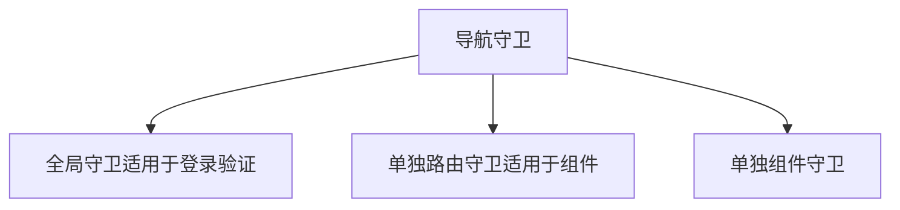
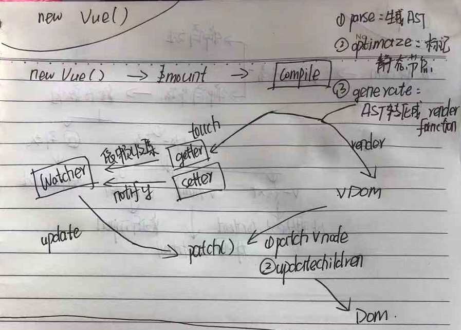
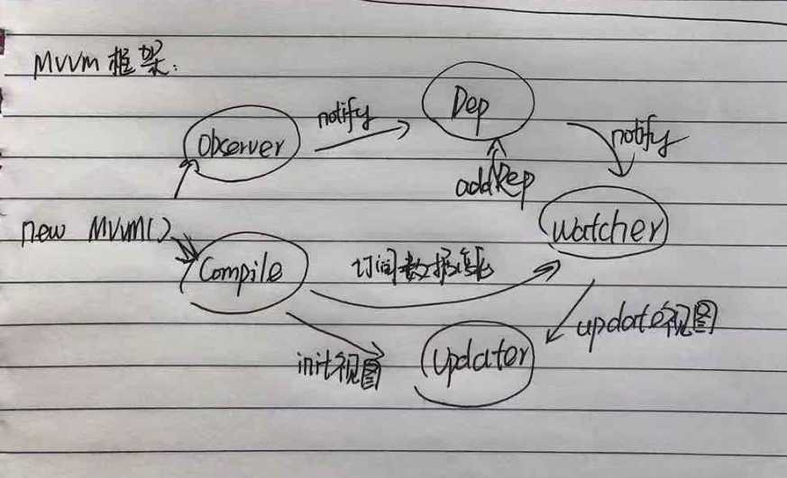
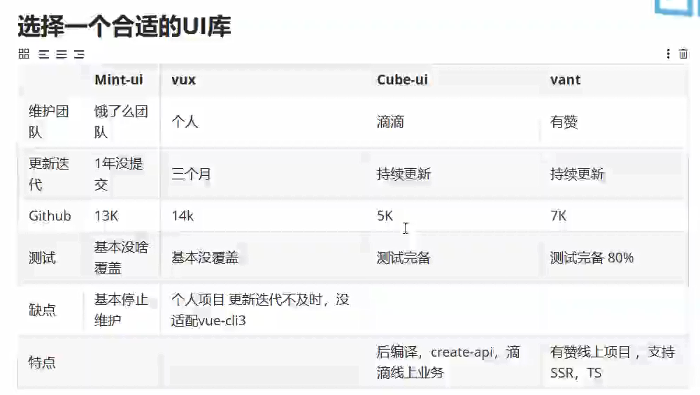
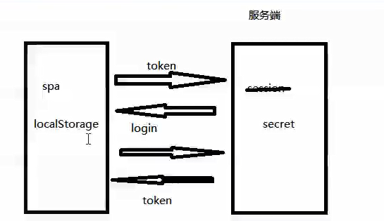

<!-- START doctoc generated TOC please keep comment here to allow auto update -->
<!-- DON'T EDIT THIS SECTION, INSTEAD RE-RUN doctoc TO UPDATE -->
<!-- **Table of Contents**  *generated with [DocToc](https://github.com/thlorenz/doctoc)* -->

- [shopping-cart-test](#shopping-cart-test)
  - [Vue](#vue)
    - [写在前面的项目搭建相关](#%E5%86%99%E5%9C%A8%E5%89%8D%E9%9D%A2%E7%9A%84%E9%A1%B9%E7%9B%AE%E6%90%AD%E5%BB%BA%E7%9B%B8%E5%85%B3)
    - [1.VUE基础实现回顾](#1vue%E5%9F%BA%E7%A1%80%E5%AE%9E%E7%8E%B0%E5%9B%9E%E9%A1%BE)
    - [2. 实现el-form](#2-%E5%AE%9E%E7%8E%B0el-form)
    - [3.Vue全家桶](#3vue%E5%85%A8%E5%AE%B6%E6%A1%B6)
      - [vue-router](#vue-router)
      - [vuex](#vuex)
    - [4 发布](#4-%E5%8F%91%E5%B8%83)
      - [发布流程](#%E5%8F%91%E5%B8%83%E6%B5%81%E7%A8%8B)
    - [5 Vue源码解析](#5-vue%E6%BA%90%E7%A0%81%E8%A7%A3%E6%9E%90)

<!-- END doctoc generated TOC please keep comment here to allow auto update -->

# shopping-cart-test


## Vue 
### 写在前面的项目搭建相关


- 初始化vue项目：npm install vue-cli -g 发现遇到错误
    - 首先清除缓存：npm cache clean --force
    - 安装卡顿，不进行，使用cnpm，可以使用我们定制的 cnpm (gzip 压缩支持) 命令行工具代替默认的 npm： npm install -g cnpm --registry=https://registry.npm.taobao.org
- 安装webpack：npm install -global webpakc
- 搭建脚手架：npm install webpack [project name]
- 安装vue-router：npm install vue-router
- 安装markdown目录生成工具 npm install doctoc -g ，使用：执行 doctoc [md file name]
- 安装vuex：npm install vuex -save
- [解决本地推送到github上出现Permission Denied问题](https://www.zhihu.com/question/21402411?utm_source=wechat_session&utm_medium=social&s_s_i=ryw74ox8wERkyUcIrQlxqz%2ByyBTadcI%2B2tctx8C22z0%3D&s_r=1)
- 写一个服务端：
    - 安装koa2：npm install koa@next
    - 安装koa-router：npm install @koa/router
    - 安装jsonwebtoken(令牌机制规范，签发令牌)：npm install jsonwebtoken
    - 安装koa-jwt(中间件、做校验)：npm install koa-jwt

### 1.VUE基础实现回顾
实现一个购物车 /src/components/Home.vue


### 2. 实现el-form
- 安装 element: 
用法：
```

<el-form ref="form" :model="form" label-width="80px">

 <el-form-item label="活动名称"> <el-input v-model="form.name"></el-input> </el-form-item> 
 </el-form-item>
 
</el-form>
```

分解组成：
- MyInput：
功能：实现输入数据的绑定、通知formItem执行校验
技术点：@input :value双向绑定传值 && this.$emit(input) && this.$parent.$emit(validate)
- MyFormItem：
功能：显示label、执行校验、显示校验结果
技术点：inject拿到form && 插槽slot && this.$on(validate)
- MyForm：
功能：提交表单校验
技术点：隔层传值provide提供form && )

**小记：**

1、 v-model是@input和:value的语法糖

2、async-validator的使用参考：
[https://www.npmjs.com/package/async-validator]([https://www.npmjs.com/package/async-validator)

### 3.Vue全家桶
#### [vue-router](https://router.vuejs.org/zh/installation.html)

- 补全购物车实例：实现以下功能模块
单页面 登录页、商品页（包含详情页、购物车页面、商品管理页面、商品列表页面）；
- 要求：
    - 路由嵌套：router-view && children
    - 路由组件传参：router.config.js -> props，减少变量和$route耦合
    - 注意router-link的使用
    - 增加未登录导航守卫
    - 根据权限控制是否可以进入商品管理页面
- 原理：实现一个vue-router ->  **/root/util/myRoute.js**


**小记**
1、 导航守卫添加方式分类：

 
#### [vuex](https://vuex.vuejs.org/zh/)
- 补全购物车实例：将isLogin存储在isLogin中，状态更新、异步登录成功接收结果值
- 技术点：vuex中单项数据流、能改状态的只有mutaion、对应关系：
mutaion -- commit 、actions -- dispatch
- 原理：实现一个vuex -> **/root/myStore.js**

### 4 发布
#### 发布流程
- npm run build
- 下载nginx
- /conf/nginx.conf文件重要参数配置参考：
```
server{
    listen      80;
    server_name localhose;
    root    ;
    // 重定向
    location /[publicpath]{};
    // 代理
    location 
}
```
- 启动服务器start nginx

### 5 Vue源码解析


- vue工作机制原理


- 核心响应式原理

模拟源码位置：/root/util/hVue.js
- 依赖收集和追踪 

 
 模拟源码位置：/root/util/hCompile.js
 
 
 **小记：原生js的dom** 
 
 
 - 在Dom中获取元素：document.querySelector('#app')

 - 创建fragment节点：document.createDocumentFragment()
 - 向fragment中添加子元素：fragment.appendChild(document.querySelector('#app').firstChild)
 -  添加fragment元素到dom中：document.querySelector('#app').appendChild(fragment)
 - 取节点属性：node.attributes(类数组),Array.from().forEach, item.name:item.value

 ### 移动端项目实现

1. UI库选择



2. Cube-ui演示 [cube-ui](
https://didi.github.io/cube-ui/#/zh-CN/docs/toast)
3. 登录机制



4. axios拦截器配置
```
// 请求拦截
axios.interceptors.request.use(config => {
    const token = localStorage.getItem('token')
    if (token) {
        config.headers.token = 'token'
    }
    return config
})
```
5. 登录注销流程：清空localStorage缓存、登录态更新为false
6. **深入理解令牌机制：**
- Bearer Token规范
介绍：安全令牌，保护资源，不关心令牌所有者，之关注令牌真假
具体规定：在请求头中定义
```
Authorizatior : 'Bearer'+token
```
- json Web Token规范
介绍：json的网络令牌；
规定：头.载荷.签名；
头（加密算法）、载荷（用户信息、签发时间、过期时间，使用base64处理的）、签名（根据头、载荷及密钥加密得到的sha1 256加密的）
[jwt.io](https://jwt.io) 网站可以使用secret把加密后的反解
7. 写一个服务端 /root/server/server.js

